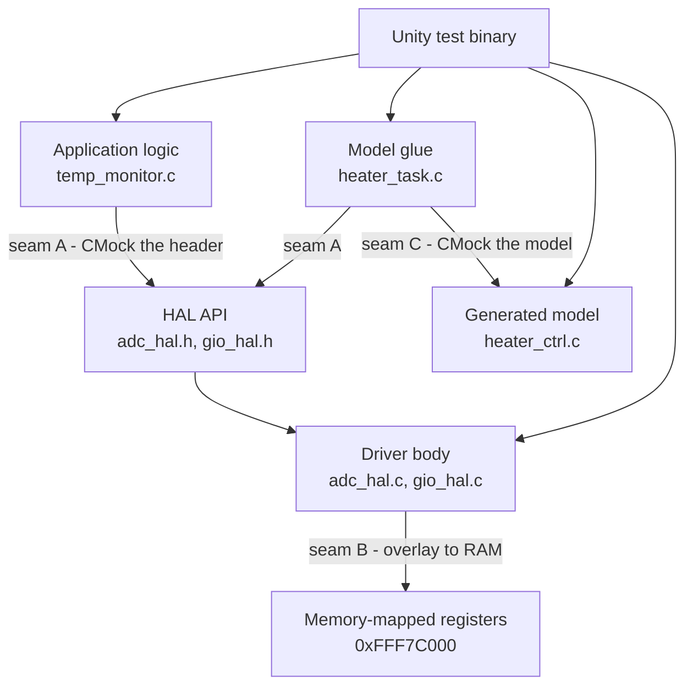
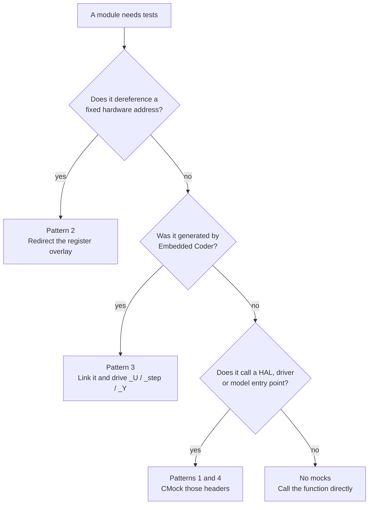
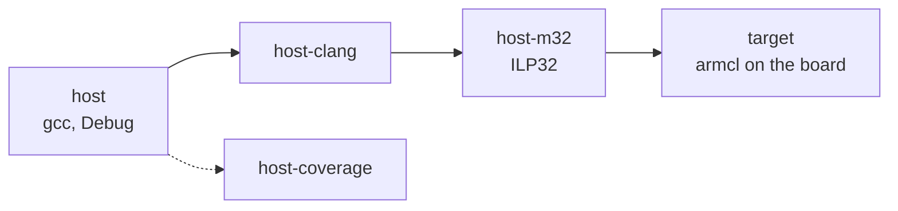
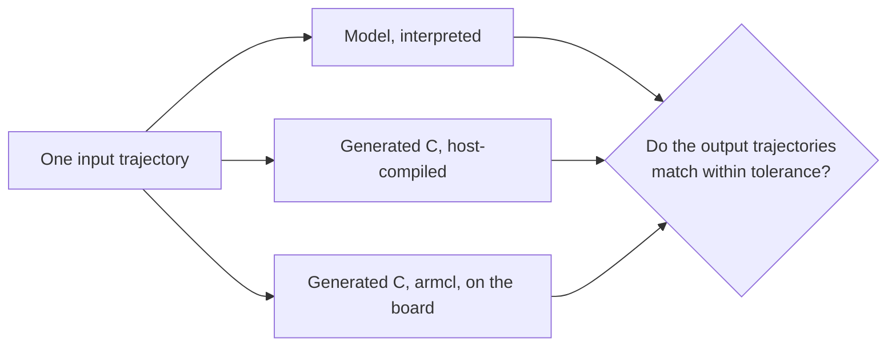

# Choosing a testing method

[01-approach-and-options.md](01-approach-and-options.md) records *which* tools were
picked for this template and why. This page is the part you need on a Tuesday
afternoon with a module in front of you: **which pattern do I use for this code, and
where do I run it?**

Two independent choices, and people routinely conflate them:

| Choice | Question it answers | Options |
|---|---|---|
| **Pattern** | How do I isolate the code under test? | mock the boundary, redirect the register overlay, drive as shipped, mock the generated model |
| **Venue** | Where does the compiled test run? | host gcc, host clang, host `-m32`, on the board, Simulink SIL/PIL |

A pattern decides what a failure *means*. A venue decides what a failure *can catch*.
You pick one of each, and they are close to orthogonal - the same test source runs on
the host and on the board without edits.

## 1. Where the seams are

Three seams, four patterns. Everything below is about picking the right one.

| Pattern | Seam | Example here | A failure means |
|---|---|---|---|
| 1. Mock the HAL boundary | A | `test_temp_monitor.c` | the application logic is wrong, or it asked the hardware for the wrong thing |
| 2. Redirect the register overlay | B | `test_adc_hal.c`, `test_gio_hal.c` | the driver writes the wrong bits, or misreads status |
| 3. Drive generated code as shipped | none | `test_heater_ctrl.c` | the model's behaviour changed |
| 4. Mock the generated model | C | `test_heater_task.c` | the glue feeds or consumes the model wrongly |

## 2. Picking a pattern

The last branch matters more than it looks. `temp_monitor_counts_to_dc()` is pure
arithmetic, so four of the fourteen tests in `test_temp_monitor.c` call it with a
number and assert a number. No fixture, no mock, no ceremony. **Reach for a mock only
when the code under test insists on talking to something.**

### Design tips

- **Test at the seam that fails independently.** The point of `test_heater_task.c`
  mocking the model is that a model change cannot redden a glue test, and a glue
  change cannot redden a model test. If one edit reddens four test files, your seams
  are in the wrong place.
- **Do not mock the thing under test.** Obvious written down, easy to do by accident
  when a module is split across two files.
- **Do not mock pure functions.** A mock of a function with no side effects buys
  nothing and costs a maintained expectation.
- **Mock a header you own, in preference to one you borrow.** `adc_hal.h` is four
  prototypes that you control; HALCoGen's `adc.h` is forty that change when somebody
  reruns the generator. CMock parses both, but only one of them is a stable contract.
  (`docs/02` §3 covers mocking HALCoGen headers directly when you must.)
- **Overlay beats mock for drivers.** Mocking a register-access helper and then
  asserting "it called the helper" tests nothing: getting the bits right *is* the
  driver's entire job. Point the overlay at RAM and assert on the bits.
- **Count your mocks.** One or two per test file is normal. `test_heater_task.c` has
  three and is at the limit. Four or more usually means the module under test has too
  many collaborators - fix the module, not the test.
- **Assert on effects, not on call counts.** CMock already fails the test when an
  expected call is missing or unexpected. Spending assertions to re-check that is
  noise; spend them on the value that came out.

## 3. Picking a venue

| Venue | Preset | Adds over the one before | Cannot prove | Run it |
|---|---|---|---|---|
| Host, gcc | `host` | logic, arithmetic, state machines, register bit patterns | anything representation-dependent | every commit, every save |
| Host, clang | `host-clang` | compiler-neutrality; a second opinion on warnings and UB | same as above | every commit (it is free) |
| Host, `-m32` | `host-m32` | ILP32: `long`, `size_t` and pointer widths as on the target | endianness, TI compiler behaviour | every commit (still free) |
| Coverage | `host-coverage` | which lines and branches nothing exercises | that the covered lines are *correct* | every commit; read it weekly |
| On the board | `target` | big-endian BE-32, `armcl` codegen, real alignment, real stack | nothing above it - this is the reference | per release, or nightly with a board in CI |
| Simulink SIL | (docs/04) | generated C matches the model | anything hand-written | per model change |
| Simulink PIL | (docs/04) | SIL, plus the real compiler and CPU | anything hand-written | per model change, manually |

### Design tips

- **Add a venue when you can name the bug class it catches.** `host-m32` exists
  because `long` is 64-bit on the host and 32-bit on the target; that is a sentence,
  so the preset earns its place. "More rigour" is not a sentence.
- **The host suite is the gate; the board is the audit.** Cross-compiling every test
  is cheap (CI does it on every commit with `target-ci`); *running* them on hardware
  is slow and flaky enough that it should not stand between a developer and a merge.
- **Schedule the byte-order-sensitive code for the board explicitly.** Union punning,
  CAN/SCI frame packing and checksums over raw memory pass on the host for the wrong
  reason. Either write them with explicit shifts and masks - then the host result is
  meaningful - or accept that only `cmake --preset target` has an opinion.
- **Never let a venue change the test source.** If a test needs `#ifdef`s to survive
  cross-compilation it is testing the wrong thing. §5 lists the rules that keep the
  same file running in both places.

## 4. When the Simulink track earns its licence

Unity tests of generated code (pattern 3) and Simulink equivalence tests answer
different questions, and the difference is worth being precise about:

| | Asks | Written by | Fails when |
|---|---|---|---|
| `test_heater_ctrl.c` | does the generated C do what the *requirement* says? | you, by hand | the model is wrong, or the requirement moved |
| Simulink equivalence | does the generated C do what the *model* does? | derived from the model | code generation or the compiler changed behaviour |

A hand-written Unity test cannot catch a code-generation bug, because you wrote the
expected value from the same understanding that produced the model. Equivalence
testing can, because neither side of the comparison is hand-written.

**Choose the Simulink track when all of these hold:** a real `.slx` exists and is the
source of truth; its generated C ships; you hold Simulink Test licences; and
"Embedded Coder changed behaviour between releases" is a risk somebody would sign
off on. Otherwise pattern 3 plus `docs/03`'s on-target run covers the same ground
for the price of a compiler. Details and an unverified scripted workflow:
[04-simulink-test.md](04-simulink-test.md).

## 5. Rules that keep one test source valid in both venues

The same `test/*.c` files compile for the host and cross-compile for the board. That
only stays true if tests avoid the host luxuries the target does not have:

- No `malloc`/`free` in tests. Use file-scope arrays, as `test_temp_monitor.c`'s
  `stash[16]` does.
- No `printf`, no `<stdio.h>`. Unity's output goes through `UNITY_OUTPUT_CHAR`, which
  `target/unity_config.h` points at the SCI.
- No `long long`, no `double` unless you have checked the TI run-time support. Use
  `<stdint.h>` widths everywhere.
- No host-only headers (`<sys/*.h>`, `<time.h>`) and no file or network access.
- Watch the stack: a test binary on the board gets what `sys_link.cmd` gave it. Large
  fixtures belong at file scope, not on the stack.

## 6. Signals you chose wrong

| Symptom | Likely cause | Fix |
|---|---|---|
| One source edit reddens several test files | seams too deep; tests reach past their own layer | mock the immediate collaborator, not the one behind it |
| A test asserts only on mock call counts | the seam is below the behaviour worth testing | move the test up a layer, or assert on the output value |
| A driver test needs 40 lines of register setup | the driver does several jobs, or the overlay struct is over-modelled | split the driver; keep the overlay to the registers actually touched |
| A model test breaks on every regeneration | it asserts on internals (`_DW`) rather than the interface | assert only on `_Y`, and on `_P` you set deliberately |
| Mock expectations get reordered until the test passes | `:enforce_strict_ordering` is telling you the call sequence is not what you thought | fix the expectation order to match the requirement, or the code |
| You cannot say in one sentence what a red test means | the test spans two seams | split it |

## 7. How this repo chose, file by file

| File | Pattern | Venue | Why that combination |
|---|---|---|---|
| `test_temp_monitor.c` | 1 - mock `adc_hal.h` | host + target | logic and error handling; the ADC is irrelevant to both |
| `test_adc_hal.c` | 2 - overlay | host + target | the register protocol *is* the behaviour under test |
| `test_gio_hal.c` | 2 - overlay | host + target | same |
| `test_heater_ctrl.c` | 3 - link the model library | host + target | the shipped object code, driven through `_U`/`_Y` |
| `test_heater_task.c` | 4 - mock model, sensor and GIO | host + target | glue only; model behaviour belongs to the file above |

Every one of them runs in all four host presets and cross-compiles with `armcl` in
CI. Next: [06-new-project-setup.md](06-new-project-setup.md) sets a project up around
whichever of these you chose, and [07-unity-best-practices.md](07-unity-best-practices.md)
covers writing the tests themselves.
