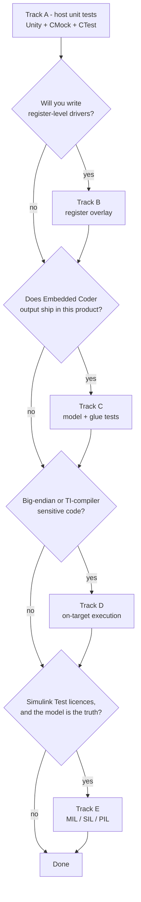

# Setting up a new project

[02-adopting-in-your-project.md](02-adopting-in-your-project.md) is the checklist for
retrofitting an **existing** TMS570 codebase. This page is the other case: a project
that does not exist yet, where you get to choose the layout before anyone has written
a line of firmware.

Decide the method first ([05-choosing-a-method.md](05-choosing-a-method.md)), then
build only the tracks you chose. Track A is the base and is not optional; B to E stack
on top of it in any combination.



| Track | You get | Costs | Prerequisites |
|---|---|---|---|
| **A** host unit tests | the per-commit gate | half a day to set up | CMake ≥ 3.21, Ninja, gcc/clang, Ruby ≥ 2.7, git |
| **B** register overlay | driver logic tested without hardware | an hour per peripheral | A |
| **C** model + glue tests | generated code tested as shipped | an hour, plus model config | A, Embedded Coder output |
| **D** on-target | endianness and `armcl` truth | a day, plus a board | A, TI CGT, HALCoGen, XDS probe |
| **E** Simulink Test | model-vs-code equivalence | days, plus licences | C, MATLAB + Simulink Test, self-hosted runner |

---

## Track A - host unit tests (the base)

### A.1 Directory skeleton

Create this much on day one, even if most of it is empty. The split between `app`,
`hal` and `gen` is what makes the seams in `docs/05` possible later.

```text
CMakeLists.txt
CMakePresets.json
.gitignore                       build/
cmake/
  FetchUnityCMock.cmake          copy verbatim
  UnityTest.cmake                copy verbatim
src/
  CMakeLists.txt
  app/                           logic; no register access, no TI intrinsics
  hal/                           thin owned wrappers + register overlays
  gen/                           Embedded Coder output, untouched (track C)
test/
  CMakeLists.txt
  support/
    cmock_config.yml             copy, then edit :treat_as
  test_<module>.c
.github/workflows/ci.yml
docs/
```

### A.2 What to copy from this template

| From | To | Edit after copying? |
|---|---|---|
| `cmake/FetchUnityCMock.cmake` | `cmake/` | no - bump the pinned tags when you choose to |
| `cmake/UnityTest.cmake` | `cmake/` | no |
| `cmake/Coverage.cmake` | `cmake/` | no - it defines `coverage_instrument()`, which `UnityTest.cmake` calls unconditionally. Inert until you configure with `COVERAGE=ON`, so take it now even if coverage is a later step |
| `test/support/cmock_config.yml` | `test/support/` | yes - `:treat_as` lists your own enum types |
| `CMakePresets.json` | root | yes - keep the presets for your tracks, delete the rest |
| `.github/workflows/ci.yml` | `.github/workflows/` | yes - delete jobs for tracks you did not take |
| `CMakeLists.txt` | root | yes - see A.3 |

Nothing else is needed for track A. `target/`, `tools/` and `matlab/` belong to
tracks D and E.

### A.3 Top-level `CMakeLists.txt`

The track-A subset, with the cross-compiling hooks left out until track D needs them:

```cmake
cmake_minimum_required(VERSION 3.21)

project(my_firmware
    VERSION 0.1.0
    DESCRIPTION "TMS570LS3137 firmware"
    LANGUAGES C)

set(CMAKE_C_STANDARD 11)
set(CMAKE_C_STANDARD_REQUIRED ON)
set(CMAKE_C_EXTENSIONS OFF)      # gcc/clang: -std=c11; armcl: --c11 --strict_ansi

include(CTest)                   # defines BUILD_TESTING, enables ctest

# Defines coverage_instrument(). cmake/UnityTest.cmake calls it on every test, and
# any generated-code library will too, so this include is required even when you are
# not measuring coverage yet - leave it out and the configure fails with
# "Unknown CMake command". It is a no-op until you configure with COVERAGE=ON.
include(cmake/Coverage.cmake)

add_subdirectory(src)            # firmware library: compiled, never run on the host

if(BUILD_TESTING)
    include(cmake/FetchUnityCMock.cmake)
    include(cmake/UnityTest.cmake)
    add_subdirectory(test)
endif()
```

`src/CMakeLists.txt` builds every firmware source into one library **without**
`UNIT_TEST`. It is never executed on the host; it exists so that the real register
addresses and the production code paths are compiled at least once per build:

```cmake
add_library(my_firmware STATIC
    app/pump_ctrl.c
    hal/flow_hal.c)
target_include_directories(my_firmware PUBLIC app hal)
target_compile_options(my_firmware PRIVATE
    $<$<C_COMPILER_ID:GNU,Clang>:-Wall;-Wextra;-Werror>)
```

`-Werror` on hand-written firmware, never on generated code or on the test
executables (`add_unity_test()` deliberately sets only `-Wall -Wextra`, because
CMock's generated mocks and runners are not yours to fix).

### A.4 Minimal `CMakePresets.json`

```json
{
  "version": 3,
  "cmakeMinimumRequired": { "major": 3, "minor": 21, "patch": 0 },
  "configurePresets": [
    {
      "name": "host",
      "displayName": "Host (gcc)",
      "generator": "Ninja",
      "binaryDir": "${sourceDir}/build/host",
      "cacheVariables": {
        "CMAKE_BUILD_TYPE": "Debug",
        "CMAKE_EXPORT_COMPILE_COMMANDS": "ON",
        "BUILD_TESTING": "ON"
      }
    },
    {
      "name": "host-clang",
      "inherits": "host",
      "binaryDir": "${sourceDir}/build/host-clang",
      "cacheVariables": { "CMAKE_C_COMPILER": "clang" }
    }
  ],
  "buildPresets": [
    { "name": "host", "configurePreset": "host" },
    { "name": "host-clang", "configurePreset": "host-clang" }
  ],
  "testPresets": [
    {
      "name": "host",
      "configurePreset": "host",
      "output": { "outputOnFailure": true }
    },
    {
      "name": "host-clang",
      "configurePreset": "host-clang",
      "output": { "outputOnFailure": true }
    }
  ]
}
```

### A.5 Draw the HAL boundary before writing the first driver

This is the decision that everything else depends on, and it is much cheaper now than
later. For each peripheral the application touches, write the header **first**, in
terms of what the application needs - not what the silicon offers:

```c
/* src/hal/flow_hal.h - the mock boundary. Keep it this small. */
#ifndef FLOW_HAL_H
#define FLOW_HAL_H

#include <stdint.h>

typedef enum {
    FLOW_HAL_OK = 0,
    FLOW_HAL_ERR_TIMEOUT,
    FLOW_HAL_ERR_BAD_ARG
} flow_hal_status_t;

void              flow_hal_init(void);
flow_hal_status_t flow_hal_read_lpm(uint16_t *lpm);   /* out-parameter */

#endif
```

Four rules for that header, all of which pay off in the tests:

1. **Return a status, take outputs by pointer.** CMock's `_ReturnThruPtr_` handles
   out-parameters cleanly; a function that returns a sentinel value in-band does not
   let a test distinguish "timeout" from "zero flow".
2. **No `volatile`, no register types, no HALCoGen types in the signature.** Those
   belong in the `.c`.
3. **Name the error cases as an enum.** Tests assert on `FLOW_HAL_ERR_TIMEOUT`, which
   reads as a requirement; `-2` does not.
4. **Keep it to what the application calls.** Every prototype here becomes mock
   surface you maintain.

Then add the type to `test/support/cmock_config.yml` so CMock can compare it:

```yaml
  :treat_as:
    flow_hal_status_t: INT
```

### A.6 The first test

`test/test_pump_ctrl.c` - no `main()`, the runner is generated:

```c
#include "unity.h"
#include "mock_flow_hal.h"
#include "pump_ctrl.h"

static uint16_t stash[8];
static unsigned stash_used;

static void given_flow_reads(uint16_t lpm)
{
    stash[stash_used] = lpm;
    flow_hal_read_lpm_ExpectAndReturn(NULL, FLOW_HAL_OK);
    flow_hal_read_lpm_IgnoreArg_lpm();
    flow_hal_read_lpm_ReturnThruPtr_lpm(&stash[stash_used]);
    stash_used++;
}

void setUp(void)
{
    stash_used = 0U;
    flow_hal_init_Expect();
    pump_ctrl_init();
}

void tearDown(void) {}

void test_pump_runs_below_setpoint(void)
{
    given_flow_reads(10U);
    TEST_ASSERT_TRUE(pump_ctrl_update());
}
```

`test/CMakeLists.txt`:

```cmake
set(SRC ${CMAKE_SOURCE_DIR}/src)

add_cmock_mock(${SRC}/hal/flow_hal.h)

add_unity_test(test_pump_ctrl
    SOURCES  ${SRC}/app/pump_ctrl.c
    MOCKS    mock_flow_hal
    INCLUDES ${SRC}/app ${SRC}/hal)
```

Run it:

```sh
cmake --preset host
cmake --build --preset host
ctest --preset host --output-on-failure
```

### A.7 CI

Copy `.github/workflows/ci.yml` and keep the host jobs. The whole contract is three
commands per preset, so a matrix job covers gcc and clang:

```yaml
- run: sudo apt-get update && sudo apt-get install -y cmake ninja-build ruby
- run: cmake --preset ${{ matrix.preset }}
- run: cmake --build --preset ${{ matrix.preset }}
- run: ctest --preset ${{ matrix.preset }} --output-on-failure
```

Make the host job a **required check** on the default branch from the first week -
before there is a backlog of red to grandfather in. `.github/rulesets/` in this repo
has a worked example, including the "job name must match exactly" trap.

### A.8 Track A is done when

- [ ] `ctest --preset host` runs at least one real test and passes
- [ ] `ctest --preset host-clang` passes too
- [ ] a deliberately broken assertion makes CTest fail (check this once, revert it)
- [ ] a missing `_Expect` makes the test fail at `CMock_Verify()` (check this once)
- [ ] mocks appear under `build/host/test/mocks/`, runners under `.../runners/`
- [ ] CI runs the same three commands and is a required check
- [ ] no test file contains `main()`

---

## Track B - register-overlay driver tests

For code that dereferences a fixed address. The mechanism: the driver is compiled
with `-DUNIT_TEST` (which `add_unity_test()` already defines), and the overlay header
redirects the base pointer to a struct the test owns.

### B.1 Write the overlay header

```c
/* src/hal/tms570_flow_regs.h */
#ifndef TMS570_FLOW_REGS_H
#define TMS570_FLOW_REGS_H

#include <stdint.h>

typedef volatile struct {
    uint32_t RSTCR;
    uint32_t OPMODECR;
    uint32_t SR;
    uint32_t BUF;
} flowBASE_t;

#ifdef UNIT_TEST
extern flowBASE_t flowREG_fake;
#define flowREG (&flowREG_fake)
#else
#define flowREG ((flowBASE_t *)0xFFF7E400U)
#endif

#endif
```

Model **only the registers the driver touches**. A faithful 60-register struct is 60
fields to clear in `setUp()` and tells you nothing extra.

### B.2 The test owns the storage

```c
#include "unity.h"
#include "flow_hal.h"
#include "tms570_flow_regs.h"

flowBASE_t flowREG_fake;          /* the definition the header declares extern */

void setUp(void)
{
    flowREG_fake.RSTCR    = 0UL;  /* clear every field the driver reads or writes */
    flowREG_fake.OPMODECR = 0UL;
    flowREG_fake.SR       = 0UL;
    flowREG_fake.BUF      = 0UL;
}
```

Pre-load status bits and data words to stand in for hardware, call the driver, assert
on what it wrote - `test_adc_hal.c` is the worked example, including the negative
cases (bad argument, timeout, channel-ID mismatch) that are the whole reason to test
a driver on the host.

### B.3 If the registers come from HALCoGen

Do **not** add `#ifdef UNIT_TEST` to generated `reg_*.h` files - the next regeneration
deletes it. Use include-guard jamming instead: a test-only `reg_flow.h` in
`test/support/` that defines the same guard macro. `docs/02` §4 has the technique in
full.

### B.4 Track B is done when

- [ ] the driver source is unmodified apart from including the overlay header
- [ ] `setUp()` clears every field the driver reads
- [ ] there is at least one test for each error return
- [ ] the non-`UNIT_TEST` build (`src/`) still compiles, so the real address survives

---

## Track C - Embedded Coder model and glue tests

### C.1 Fix the model configuration first

Get these right before the first generation, because changing them later changes the
generated interface and every test with it ([`docs/02` §5.2](02-adopting-in-your-project.md)
has the reasoning):

| Parameter | Set to |
|---|---|
| System target file | `ert.tlc` |
| Code interface packaging | Nonreusable function |
| Generate an example main program | off |
| Default parameter behavior | Tunable |
| Hardware Implementation → Device | ARM Compatible / ARM Cortex-R |

### C.2 Land the output where CMake can see it

Copy `<model>_ert_rtw/` to `src/gen/<model>_ert_rtw/` verbatim, or point Embedded
Coder's code generation folder there. Add exactly one file of your own to that
directory - a `CMakeLists.txt` building the model as a static library with its own
warning policy (report, never `-Werror`; you cannot fix generated code, you change
the model). Then in `test/CMakeLists.txt`:

```cmake
add_unity_test(test_my_model LIBS my_model)    # no SOURCES, no mocks
```

`LIBS` links the library **as shipped** - no `UNIT_TEST` recompile - so the object
code under test is what the firmware links.

### C.3 Add the generated types to `cmock_config.yml`

```yaml
  :treat_externs: :include     # every EC entry point is `extern`; without this the
                               # model mock generates empty and the link fails
  :treat_as:
    boolean_T: UINT8
    real32_T:  FLOAT
    real_T:    DOUBLE
```

### C.4 Two test files, not one

Model behaviour and glue behaviour fail for different reasons, so they get different
files: `test_<model>.c` drives `_U`/`_step()`/`_Y` directly, and `test_<glue>.c`
mocks the model and defines its `_U`/`_Y` globals itself with a `_Stub()` callback.
`docs/02` §5.4 and §5.5 have both patterns, including the include-order rule for
`rtwtypes.h` versus `<stdbool.h>`.

### C.5 Track C is done when

- [ ] `src/gen/` contains no file you edited except `CMakeLists.txt`
- [ ] the model test links the library, not recompiled sources
- [ ] `setUp()` clears `_DW`, `_U` and `_Y`, and saves/restores `_P`
- [ ] a regeneration produces a diff confined to `src/gen/`
- [ ] the glue test still passes when the model's behaviour changes

---

## Track D - on-target execution

Full procedure in [03-on-target.md](03-on-target.md). The setup-time summary:

1. Copy `cmake/toolchain-ti-armcl.cmake`, `target/`, `tools/run_on_target.sh`,
   `tools/unity_serial_capture.py` and the `target*` presets.
2. Generate a HALCoGen project into `target/halcogen/` (git-ignored - it is TI's
   code, and it is regenerated, not reviewed). Enable the SCI you will print over.
3. Point `target/unity_config.h`'s `UNITY_OUTPUT_CHAR` at that SCI.
4. `export TI_CGT_ARM_ROOT=...`, then `cmake --preset target && ctest --preset target`.
5. In CI, add `target-ci` (real `armcl`, stub board support, compile and link only)
   and `target-dryrun` (no TI tools at all). Both catch cross-build breakage on every
   commit without a board.

Keep `UNIT_TEST` defined on the target too: the overlay tests are driver-*logic*
tests, and pointing them at real peripherals would make them hardware tests with a
completely different failure meaning.

**Done when:** every host test also runs on the board and passes; CI compiles and
links the whole tree with `armcl` on every commit; the board run is scheduled (per
release or nightly), not in the merge path.

---

## Track E - Simulink Test

Needs track C plus MATLAB, Simulink, Embedded Coder, Simulink Test and a self-hosted
runner. The sketch - model interface, scripted Test Manager file, headless CI entry
point, and why none of it runs on GitHub-hosted runners - is in
[04-simulink-test.md](04-simulink-test.md) with scripts in `matlab/`. Nothing in that
track has been executed, so budget time to adapt it to your MATLAB release before
relying on it.

Do not wire it into required checks until it has run green on your runner twice.

---

## Cross-cutting add-ons

| Add-on | Copy | Preset | Worth it when |
|---|---|---|---|
| Coverage | already copied and included in A.2/A.3; add the preset, and call `coverage_instrument()` on any library you add yourself | `host-coverage` | as soon as there is real code; gate on lines, read branches (`docs/02` §8) |
| ILP32 check | preset only | `host-m32` | immediately - it is free and catches `long` assumptions (`docs/02` §9) |
| Second compiler | preset only | `host-clang` | immediately |
| Branch protection | `.github/rulesets/` | - | first week, before the backlog |
| Markdown lint | `.markdownlint-cli2.jsonc` + the `markdown-lint` job | - | as soon as there are docs worth trusting; pin the linter version in the job |

## Suggested sequencing

| When | Do |
|---|---|
| Day 1 | Track A skeleton, one real test, CI green, host + host-clang presets |
| Day 2 | HAL headers for every peripheral the application will touch; `host-m32` |
| Week 1 | Track B for the first driver; required checks turned on |
| Week 2 | Coverage on, gate at whatever the suite currently achieves |
| First model | Track C, both test files |
| Before first release | Track D, one full run on the board |
| If and when licensed | Track E |

## First-run troubleshooting

| Symptom | Cause | Fix |
|---|---|---|
| `undefined reference to <fn>_Expect` | CMock skipped an `extern` prototype | `:treat_externs: :include` |
| Mock generated but empty | same, or the header guards hid the prototypes | check the header parses standalone |
| `undefined reference to main` | the runner was not generated | the test file must be `test/<name>.c` matching `add_unity_test(<name>)` |
| `cannot find unity.h` | test not linked against `unity::framework` | use `add_unity_test()`, do not hand-roll `add_executable` |
| Ruby not found at configure time | CMock and the runner generator need it | install Ruby ≥ 2.7; it is generation-time only |
| Tests pass individually, fail together | file-scope state leaking between tests | reset it in `setUp()`, not at declaration |
| A test passes on host, fails on target | endianness or integer width | see `docs/05` §5 and §3 |
| `#pragma` or intrinsic rejected by gcc | TI-only syntax reached the host build | stub header in `test/support/` (`docs/02` §3) |

Writing the tests themselves: [07-unity-best-practices.md](07-unity-best-practices.md).
