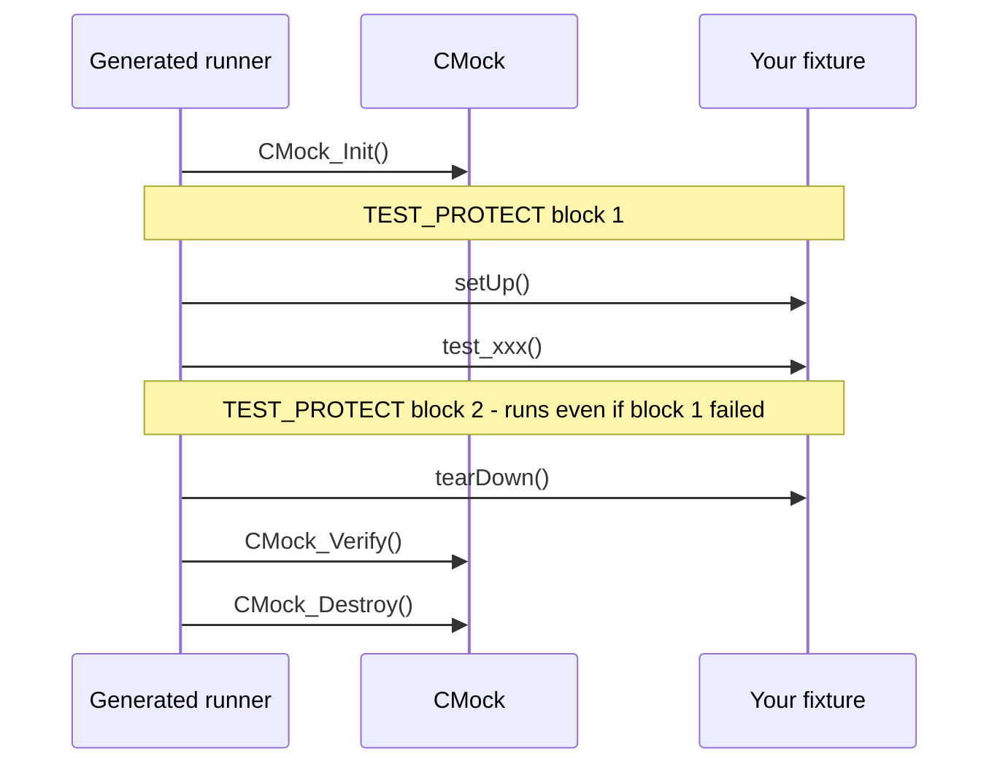

# Unity unit-test best practices

Conventions for writing Unity + CMock tests in a TMS570 project. Every example is
taken from, or matches, the tests in `test/`. [05](05-choosing-a-method.md) decides
*which* kind of test to write and [08](08-test-design-and-strategy.md) decides *which
cases* it should cover; this page is about writing it well once both are settled.

The rules that look fussy - no `malloc`, explicit tolerances, reset state in
`setUp()` - are the ones that keep the same source file running on the host **and**
on the board, and keep a red test meaningful at 5pm on a Friday.

## 1. The lifecycle you are writing into

Tests never define `main()`. `generate_test_runner.rb` scans the file for
`void test_*(void)` functions and `#include "mock_*.h"` lines and emits a runner
around them. Per test, that runner does:



Three consequences worth internalising:

- **`CMock_Verify()` runs after `tearDown()`.** Expected-but-never-called mocks are
  reported against the test, after your cleanup. Do not try to verify mocks yourself.
- **A failed assertion aborts the test immediately** (Unity longjmps out), but
  `tearDown()` and `CMock_Verify()` still run because they sit in a second
  `TEST_PROTECT()` block. Anything that must be restored belongs in `tearDown()`, not
  at the end of the test body.
- **Assertions after the first failure never execute.** Put the most specific
  assertion first, and never write a test whose later assertions are the real point.

## 2. Anatomy of a test file

Use the same running order in every file; reviewers then always know where to look.
`test_temp_monitor.c` is the reference:

```c
/**
 * @file test_pump_ctrl.c
 * @brief What this file tests, and what it deliberately does not.
 */
#include "unity.h"           /* 1. unity first                          */
#include "mock_flow_hal.h"   /* 2. mocks - one per mocked boundary      */
#include "pump_ctrl.h"       /* 3. the unit under test                  */

/* ---- helpers ------------------------------------------------------ */
/* given_*() / expect_*() wrappers around mock setup                    */

/* ---- test data ---------------------------------------------------- */
/* named constants, with the physical value in the comment              */

/* ---- fixture ------------------------------------------------------ */
void setUp(void);
void tearDown(void);

/* ---- <behaviour group> -------------------------------------------- */
/* tests, grouped by behaviour with a banner comment per group          */
```

The header comment earns its place by saying what the file does **not** cover -
`test_heater_task.c` opens by explaining that model behaviour is
`test_heater_ctrl.c`'s job. That one sentence stops the next person adding model
assertions to the glue test.

### Include order is not cosmetic

In any file mixing hand-written headers with Embedded Coder output, the hand-written
ones come first, because they pull in `<stdbool.h>` ahead of `rtwtypes.h`. Reversed,
`rtwtypes.h` defines `true`/`false` as `1U`/`0U` and `<stdbool.h>` then redefines
them - silent on gcc, a build break under `-Werror` on other front ends. See
`docs/02` §5.3.

## 3. Naming

`test_<what>_<condition or expected result>`. The generated runner prints the name on
failure, so the name is the failure message you get for free:

| Good | Why |
|---|---|
| `test_warn_has_hysteresis` | names the behaviour, not the function |
| `test_read_rejects_channel_out_of_range_without_touching_hardware` | long, but states the requirement *and* the side condition |
| `test_error_counter_saturates_without_wrapping` | describes the bug class it guards |
| `test_latched_fault_dominates_sensor_error` | states a priority rule |

| Avoid | Why |
|---|---|
| `test_update_1`, `test_update_2` | a failure tells you nothing |
| `test_temp_monitor_update` | names the function; says nothing about which of its behaviours broke |
| `test_bug_4127` | the ticket will outlive your access to the tracker; put it in a comment instead |

## 4. One behaviour per test

A test should fail for exactly one reason. That does not mean one assertion -
`test_read_selects_requested_channel_and_returns_fifo_value` asserts on the status,
the channel-select register and the returned counts, because those three facts are
one behaviour. It means: when this test goes red, you should be able to name the
broken requirement before opening the file.

Sequences are one behaviour too. `test_warn_has_hysteresis` drives three readings and
asserts three statuses, because hysteresis is not observable in a single step:

```c
void test_warn_has_hysteresis(void)
{
    given_adc_reads(COUNTS_FOR_900_DC); /* enters WARN             */
    given_adc_reads(COUNTS_FOR_820_DC); /* in band: still WARN     */
    given_adc_reads(COUNTS_FOR_780_DC); /* below clear: back to OK */

    TEST_ASSERT_EQUAL(TEMP_MONITOR_WARN, temp_monitor_update());
    TEST_ASSERT_EQUAL(TEMP_MONITOR_WARN, temp_monitor_update());
    TEST_ASSERT_EQUAL(TEMP_MONITOR_OK,   temp_monitor_update());
}
```

Queue all the expectations up front, then run the sequence. It reads as a scenario,
and the arrange/act split stays visible.

## 5. Fixtures and static state

Firmware modules keep file-scope state, so tests leak into each other unless you stop
it. Both halves are required:

- **Give the module an `_init()`** and call it from `setUp()`. If a module cannot be
  returned to a known state, that is a design defect the tests are reporting early.
- **Reset the test's own state in `setUp()`, not at declaration.** `stash_used = 0U;`
  lives in `setUp()`; a static initialiser runs once per *process*, not per test.

```c
void setUp(void)
{
    stash_used = 0U;              /* test's own fixture state */
    adc_hal_init_Expect();        /* the module's init calls the HAL */
    temp_monitor_init();
}
```

For generated models, `setUp()` also `memset`s `_DW`, `_U` and `_Y` (ERT's default
"remove internal data zero initialization" means `_initialize()` will not), and any
test that writes `_P` must restore it - a tunable parameter is one global shared by
every test in the binary.

An empty `tearDown()` is fine and should stay in the file: it is required, and its
presence tells the next reader that nothing needs undoing.

## 6. Choosing the assertion

The specific macro produces a better failure message than the general one. `EQUAL`
prints `Expected 2 Was 3`; `EQUAL_HEX32` prints `Expected 0x00000002 Was 0x00000003`,
which is what you want when the value is a register.

| Asserting on | Use | Not |
|---|---|---|
| a status enum | `TEST_ASSERT_EQUAL(EXPECTED, actual)` | `TEST_ASSERT_TRUE(a == b)` - no values printed |
| a register word or bit pattern | `TEST_ASSERT_EQUAL_HEX32` | `TEST_ASSERT_EQUAL` |
| specific bits set | `TEST_ASSERT_BITS_HIGH(mask, value)` | hand-written `&` plus `TRUE` |
| specific bits clear | `TEST_ASSERT_BITS_LOW(mask, value)` | as above |
| a sized integer | `TEST_ASSERT_EQUAL_INT16` / `UINT16` / … | `TEST_ASSERT_EQUAL` - hides truncation |
| a float that went through arithmetic | `TEST_ASSERT_FLOAT_WITHIN(tol, exp, act)` | `TEST_ASSERT_EQUAL_FLOAT` |
| a boolean | `TEST_ASSERT_TRUE` / `_FALSE` | `TEST_ASSERT_EQUAL(1, …)` |
| a pointer | `TEST_ASSERT_NULL` / `_NOT_NULL` / `_EQUAL_PTR` | integer comparisons |
| a buffer | `TEST_ASSERT_EQUAL_HEX8_ARRAY(exp, act, len)` | a loop of scalar asserts |
| raw bytes of a struct | `TEST_ASSERT_EQUAL_MEMORY(exp, act, size)` | field-by-field (misses padding changes) |
| something inside a loop | the `_MESSAGE` variant | the plain one - you will not know which iteration |

`TEST_ASSERT_EQUAL_FLOAT` compares with a *relative* tolerance
(`UNITY_FLOAT_PRECISION`, 1e-5 by default). That is both too tight after accumulated
arithmetic and, more importantly, invisible: `TEST_ASSERT_FLOAT_WITHIN(0.05f, 40.0f,
setpoint)` states the tolerance the requirement actually allows, and a reviewer can
challenge it.

In loops, carry the index in the message:

```c
TEST_ASSERT_LESS_THAN_MESSAGE(sizeof(stash) / sizeof(stash[0]), stash_used, "stash full");
```

## 7. Name your test data

Magic numbers in embedded tests are usually the result of a conversion, and the
reader cannot check them. Name them and put the physical value in the comment:

```c
#define COUNTS_FOR_900_DC   (1738U)   /*  90.0 degC - above WARN_SET     */
#define COUNTS_FOR_820_DC   (1638U)   /*  82.0 degC - inside hysteresis  */
```

Choose values that land exactly on the boundary the requirement names, so the integer
arithmetic does not need a tolerance. Test the edges: at the threshold, one count
below, one count above, zero scale, full scale, and the out-of-range input.

## 8. Helper functions carry the scenario

Three lines of CMock setup repeated eleven times hides the scenario. A `given_*()`
helper names it:

```c
static void given_adc_reads(uint16_t counts)
{
    stash[stash_used] = counts;
    adc_hal_read_channel_ExpectAndReturn(TEMP_MONITOR_ADC_CHANNEL, NULL, ADC_HAL_OK);
    adc_hal_read_channel_IgnoreArg_counts();
    adc_hal_read_channel_ReturnThruPtr_counts(&stash[stash_used]);
    stash_used++;
}
```

Conventions that keep helpers readable: `given_*` arranges, `expect_*` queues an
expected outgoing call, `step_n()` advances time. Helpers may call `TEST_ASSERT_*`
(useful for guarding their own preconditions), but the assertions that express the
requirement belong in the test body where they can be read.

## 9. CMock expectations

| Call | Meaning | Use when |
|---|---|---|
| `fn_Expect(args)` | exactly this call, these arguments, void return | the normal case |
| `fn_ExpectAndReturn(args, ret)` | as above, with a return value | the normal case |
| `fn_IgnoreArg_<param>()` | drop argument checking for one parameter of the **most recently queued** expectation | out-parameters, opaque handles |
| `fn_ReturnThruPtr_<param>(p)` | copy `*p` into that out-parameter when the call runs | any pointer output |
| `fn_ExpectAnyArgs()` | the call must happen; arguments unchecked | the call matters, its arguments do not |
| `fn_Ignore()` | any number of calls, **including none**, unchecked | last resort - see below |
| `fn_Stub(cb)` | replace the mock body with your function | effects on globals, e.g. a generated `Model_step()` |

Two traps, both of which this repo hit:

**`_ReturnThruPtr_` copies at call time, not at queue time.** The pointer you hand it
must still be valid when the code under test makes the call - which is after the
helper that queued it has returned. A local variable in the helper is a dangling
pointer; that is why `test_temp_monitor.c` keeps a file-scope `stash[]`.

**`_Ignore()` is satisfied by zero calls.** It is the weakest statement available and
turns a test that should assert an interaction into one that cannot fail on it.
Prefer `_ExpectAnyArgs()` when the call must happen but the arguments do not matter.

### Strict ordering

`:enforce_strict_ordering: true` in `test/support/cmock_config.yml` makes the order of
expectations part of the test, globally across all mocks in the binary. For drivers
this is the point - "reset before enable" is a requirement, not an accident. When a
reordering makes a test pass, treat it as a finding: either the requirement says that
order and the code is wrong, or the requirement does not and the expectation was
over-specified.

### Mocking a generated model

The mock supplies functions; the model's `_U`/`_Y` are extern globals it does not
define. The test defines them and installs a `_Stub()` that snapshots the inputs and
writes the outputs the scenario needs:

```c
ExtU_heater_ctrl_T heater_ctrl_U;        /* normally defined in heater_ctrl.c */
ExtY_heater_ctrl_T heater_ctrl_Y;

static void fake_heater_ctrl_step(int num_calls)
{
    (void)num_calls;
    seen_U = heater_ctrl_U;
    heater_ctrl_Y = next_Y;
}

void setUp(void) { heater_ctrl_step_Stub(fake_heater_ctrl_step); }
```

This keeps the glue test independent of what the model actually computes, which is
the whole reason for mocking it. Requires `:treat_externs: :include`.

## 10. What not to mock

- **Pure functions.** Call them.
- **The unit under test**, including its other translation unit if it has one.
- **Value types and structs.** Build one and pass it.
- **`<string.h>`, `<stdint.h>`** and other standard machinery.
- **Register accessors**, when the registers *are* the behaviour - use the overlay
  ([05](05-choosing-a-method.md) §2).

## 11. Time is a step count

There is no clock. An expectation written as "faults after 300 ms" at Ts = 0.1 s is
"on the third step". Write a `step_n()` helper, name the constant after the
requirement, and let the test read in requirement units:

```c
static boolean_T step(real32_T temp_degC, boolean_T enable)
{
    heater_ctrl_U.temp_degC = temp_degC;
    heater_ctrl_U.enable    = enable;
    heater_ctrl_step();
    return heater_ctrl_Y.heater_cmd;
}

static void step_n(real32_T temp_degC, boolean_T enable, unsigned n)
{
    while (n-- > 0U) { (void)step(temp_degC, enable); }
}
```

which lets a debounce requirement read as one:

```c
step_n(T_OVER, true, 2U);
TEST_ASSERT_FALSE(heater_ctrl_Y.fault);   /* two steps: not yet */

(void)step(T_OVER, true);
TEST_ASSERT_TRUE(heater_ctrl_Y.fault);    /* third step: fault  */
```

Never call `sleep()`, read the wall clock, or make a test's result depend on how long
it took to run.

## 12. Keeping tests portable to the board

The same file cross-compiles with `armcl` and runs on the TMS570 ([03](03-on-target.md)).
That stays true only if tests obey the target's constraints:

| Rule | Why |
|---|---|
| no `malloc`/`free` | no heap worth having; use file-scope arrays |
| no `printf`, no `<stdio.h>` | Unity output goes through `UNITY_OUTPUT_CHAR` to the SCI |
| no `<time.h>`, `<sys/*.h>`, files, sockets | not there |
| `<stdint.h>` widths, never bare `long` | `long` is 64-bit on the host, 32-bit on the target |
| avoid `long long` and `double` | TI run-time support and code size |
| large fixtures at file scope | the target stack is whatever `sys_link.cmd` gave it |
| no `#ifdef` on the venue | if a test needs to know where it runs, it is testing the wrong thing |

## 13. Reading coverage

`cmake --preset host-coverage` then `cmake --build --preset host-coverage-report`.
Gate on line coverage; *read* branch coverage. The two branch misses in this repo's
first report were both the "already at maximum" side of a saturating counter
(`if (count < MAX) count++`) - a wrapping counter would have cleared a latched fault,
so both became tests (`test_error_counter_saturates_without_wrapping` and its model
twin). Expect the branch view to point at exactly that: the defensive path nobody
exercised.

Coverage tells you what is untested. It does not tell you that what is covered is
correct, and a percentage is not a substitute for testing the boundary values in §7.
[08](08-test-design-and-strategy.md) §4 goes into how much is enough, and §3.2 there
shows this suite passing at 100% line coverage while three of `temp_monitor.c`'s four
threshold comparisons can be broken without a test noticing.

## 14. Anti-patterns

| Anti-pattern | Why it hurts | Instead |
|---|---|---|
| Asserting on mock call counts and nothing else | CMock already enforces that; the test proves no behaviour | assert on the value produced |
| `_Ignore()` sprinkled to make a test pass | silently accepts zero calls | `_ExpectAnyArgs()`, or fix the expectation |
| One test per function | functions are not behaviours | one test per behaviour, several per function |
| Logic in the test that mirrors the code | both wrong together | hard-code the expected value |
| `TEST_ASSERT_TRUE(a == b)` | failure prints no values | the typed `EQUAL` macro |
| Tests that must run in order | one failure cascades | independent tests; reset in `setUp()` |
| Reordering expectations until green | hides a real sequencing question | decide what the requirement says |
| Commenting out a red test | it will not come back | fix it, or `TEST_IGNORE_MESSAGE("why, ticket")` so it is reported |

`TEST_IGNORE_MESSAGE()` is the honest way to park a test: Unity reports it as ignored
rather than passed, so it appears in the CTest output and in CI.

## 15. Review checklist

- [ ] file header says what this file covers and what it deliberately does not
- [ ] no `main()`; the runner is generated
- [ ] test names state behaviour, readable as a failure message
- [ ] `setUp()` resets module state and the file's own fixture state
- [ ] `tearDown()` restores anything global the tests write (`_P`, saved config)
- [ ] typed assertion macros; `HEX` for registers, `FLOAT_WITHIN` with a stated tolerance
- [ ] test data named, with physical units in comments; boundaries tested
- [ ] every `_ReturnThruPtr_` source outlives the queued expectation
- [ ] no `_Ignore()` where `_ExpectAnyArgs()` would do
- [ ] mock count ≤ 3; more means the module has too many collaborators
- [ ] nothing from §12's forbidden list
- [ ] the test fails if you break the behaviour - check it once, then revert

That last one is the only item on the list that catches a test asserting nothing at
all, and it takes ten seconds.
