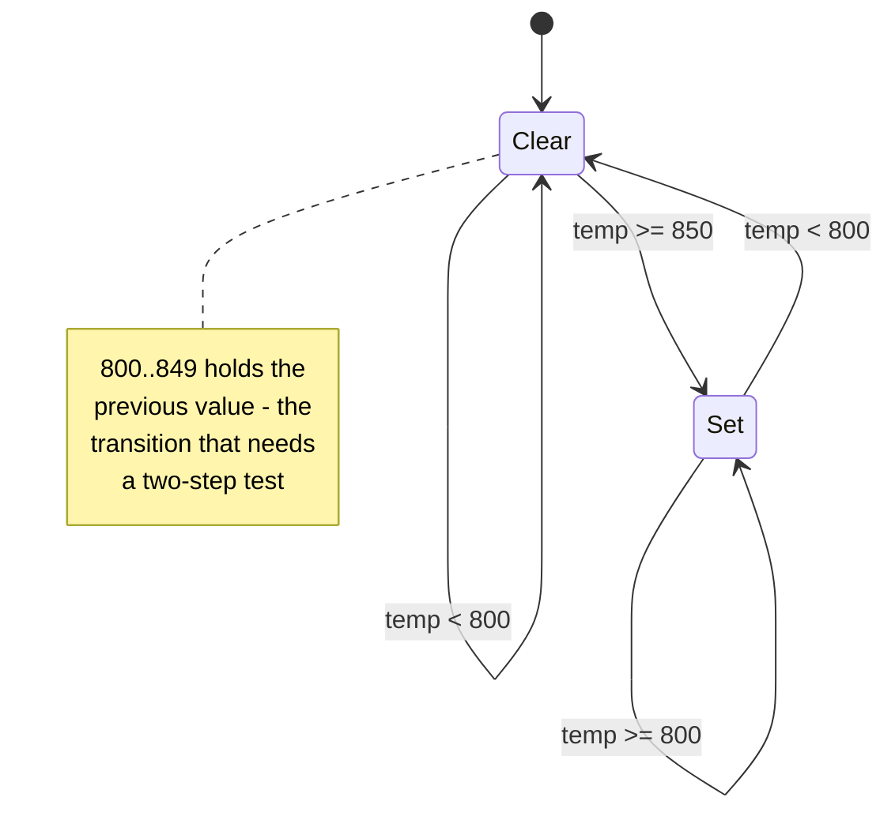
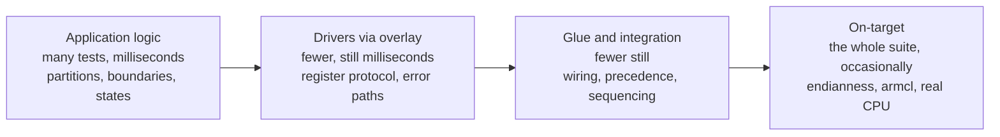

# Test design and strategy

[05](05-choosing-a-method.md) picks the method for a module.
[07](07-unity-best-practices.md) is the Unity and CMock mechanics. This page is the
judgement in between: **what to test, how to derive the list rather than guess it,
how much is enough, and what order to do it in.**

Nothing here is Unity-specific. It applies equally to the on-target run and, with a
change of vocabulary, to the Simulink track.

## 1. What makes a test good

A test is a claim about a **requirement**, expressed in code. It is not a claim about
the implementation - that distinction decides most of what follows.

| Property | The question to ask | Smell when it is missing |
|---|---|---|
| **Falsifiable** | if I break this behaviour, does *this* test go red? | the test passes against deliberately broken code |
| **Specific** | when it goes red, do I know the requirement it broke? | you open the file to find out what failed |
| **Singular** | is there exactly one reason this can fail? | the name contains "and" |
| **Independent** | does it pass when run alone, and in any order? | it only passes after its neighbour |
| **Deterministic** | does it give the same answer every run, forever? | "re-run it, it's flaky" |
| **Fast** | milliseconds, so nobody avoids running it | people push without running the suite |
| **Readable as documentation** | can a new engineer learn the requirement from it? | the test needs a comment explaining the expected value |

The first one is the only one that catches a test asserting nothing at all, and it is
the cheapest to check: break the line, watch the test fail, revert. Do it once per
test, when you write it. A suite of tests that have never been seen to fail is a
suite of unknown value.

**Corollary - test behaviour, not implementation.** `test_warn_has_hysteresis` stays
green through any rewrite of `temp_monitor.c` that keeps the hysteresis. A test that
asserted on `s.warn_active` directly would break on a refactor that changed nothing
observable, which trains people to "fix" tests by editing the expected value.

## 2. Derive the list; do not guess it

Most weak suites are weak because the tests were chosen by asking "what shall I test?"
rather than by applying a technique. The techniques below are old and boring and they
find the cases intuition skips.

| Technique | Finds | Applied here |
|---|---|---|
| **Equivalence partitioning** | one test per class of input that should behave the same | cold / hysteresis band / warm / over-temperature |
| **Boundary value analysis** | the off-by-one at every threshold - *the highest-yield technique in firmware* | at the threshold, and one count either side |
| **State transition** | illegal or forgotten transitions, and "sticky" state | warn set/clear, fault latch/unlatch |
| **Decision tables** | wrong precedence when conditions combine | fault vs sensor-error vs warn priority |
| **Sequence and timing** | debounce, filters, counters - anything where *n* consecutive matters | 3 consecutive ADC failures; the model's debounce |
| **Defensive paths** | the `if (p == NULL)` nobody executes | NULL result pointer, out-of-range channel |
| **Data-type edges** | saturation, wrap, truncation, sign | the `uint8_t` error counter at its maximum |

Rule of thumb for embedded: **boundaries first, then states, then combinations.**
Arithmetic bugs in firmware cluster at thresholds and at type limits, not in the
middle of ranges.

## 3. Worked example - deriving `test_temp_monitor.c`

`temp_monitor` is small enough to derive exhaustively and real enough to be
instructive. Its inputs are the ADC result, the ADC status, the *sequence* of calls,
and `temp_monitor_clear_fault()`.

### 3.1 Partition the temperature axis

Thresholds are `WARN_CLEAR_DC = 800`, `WARN_SET_DC = 850`, `FAULT_DC = 1000`:

| Partition | Range (deci-degC) | Expected |
|---|---|---|
| cold | `< 800` | warn clears |
| hysteresis band | `800 .. 849` | warn holds its previous value |
| warm | `850 .. 999` | warn sets |
| over-temperature | `>= 1000` | warn sets **and** fault latches |

One representative from each is four tests. The suite has them: 780, 820, 900 and
1050 deci-degC.

### 3.2 Then the boundaries

Partition representatives do not catch `>` written for `>=`. Boundary values do, and
here they have to be expressed in ADC counts, because that is what the code receives.
Working backwards through `counts * 3300 / 4095 - 500`:

| Boundary | Counts | Result (dC) | Should |
|---|---|---|---|
| just below `WARN_CLEAR` | 1613 | 799 | clear warn |
| at `WARN_CLEAR` | 1614 | 800 | **hold** warn (clear needs `< 800`) |
| just below `WARN_SET` | 1675 | 849 | not set warn |
| at `WARN_SET` | 1676 | 850 | set warn |
| just below `FAULT` | 1861 | 999 | not latch |
| at `FAULT` | 1862 | 1000 | latch |

**This is a real gap in the current suite, and it has been measured.** Applying §4.3's
break-it check to `temp_monitor.c`:

| Mutation | Suite result |
|---|---|
| `temp_dc >= FAULT_DC` → `>` | **passes** - defect not caught |
| `temp_dc >= WARN_SET_DC` → `>` | **passes** - defect not caught |
| `temp_dc < WARN_CLEAR_DC` → `<=` | **passes** - defect not caught |
| `error_count >= MAX_SENSOR_ERRORS` → `>` | fails - defect caught |

Three of the four off-by-one mutations survive. The counter one is caught only because
`test_sensor_error_only_after_consecutive_failures` happens to sit exactly on its
threshold - which is precisely what §3.2 asks you to do deliberately for the other
three. The pure conversion function *is* boundary-tested (0, mid, 4095 and the
out-of-range `0xFFFF` clamp), and the suite reports 100% line coverage, which is why
this gap is easy to miss. Worth closing.

### 3.3 State transitions

The observable `temp_monitor_status_t` is not a stored state machine - it is a
*projection* of three independent state variables (`fault_latched`, `warn_active`,
`error_count`) computed by `resolve_status()`. Design the tests accordingly: exercise
each variable's transitions separately, then test the projection as a decision table
(§3.5). Treating the four-valued enum as one state machine produces a confusing and
incomplete test list.

`warn_active` is the clean state machine:



The self-transitions are the point: the band `800..849` behaves differently depending
on where you came from, so it cannot be tested with a single sample.
`test_warn_has_hysteresis` drives 900 → 820 → 780 to cover the interesting path.

`fault_latched` is a latch, so its test list is: does it set, does it *stay* set when
the cause goes away, does `clear_fault()` release it, and does it re-latch if the
condition is still true. All four exist
(`test_fault_latches_until_cleared`, `test_clear_fault_relatches_if_still_hot`).

### 3.4 Counters and sequences

`error_count` is a saturating `uint8_t` counter with threshold 3:

| Case | Why |
|---|---|
| 2 failures - no error | below threshold |
| 3 consecutive failures - error | at threshold |
| failure, failure, success, failure, failure - no error | a good read resets it |
| 10 consecutive failures - still error | saturation; a wrapping counter would clear it |

The last one is the data-type edge, and it is not hypothetical: the first coverage
report on this repo flagged the `if (count < MAX)` guard's untaken branch in exactly
this counter, and in the model's debounce counter. Both became tests. **Branch
coverage finds saturation bugs reliably** - see §4.2.

### 3.5 Combinations - the decision table

`resolve_status()` has a priority order. Priority rules are where combination bugs
live, and a table makes the missing rows obvious:

| `fault_latched` | `error_count >= 3` | `warn_active` | Status |
|---|---|---|---|
| true | any | any | `FAULT` |
| false | true | any | `SENSOR_ERROR` |
| false | false | true | `WARN` |
| false | false | false | `OK` |

Three tests are needed to pin the two precedence edges and the base case; the suite
has `test_latched_fault_dominates_sensor_error` for the first. Write the table, then
check each row has a test. Rows that cannot occur are worth a comment saying why.

### 3.6 The derived list

Partitions (4) + boundaries (6) + warn transitions (2) + latch behaviour (4) +
counter cases (4) + precedence (3) + defensive paths + pure-function edges. That is a
list you can defend in a review, arrived at by method rather than by how long you felt
like working.

## 4. How much is enough

### 4.1 Risk decides depth, not uniformity

Not every module deserves the §3 treatment. Spend where a defect is expensive:

| | Cheap to catch later | Expensive to catch later |
|---|---|---|
| **Low consequence** | representative tests only | partitions + boundaries |
| **High consequence** | partitions + boundaries | the full §3 derivation, plus an on-target run |

For a TMS570 project, "expensive to catch later" usually means: it only reproduces on
hardware, it is in a safety path, it is in code that other modules depend on, or it is
in the generated model where a fix means a model change and a regeneration.

### 4.2 Coverage is a floor, not a target

- **Gate on line coverage, read branch coverage.** Lines tell you what was never
  executed; branches tell you which *half* of a condition was never taken, which is
  where saturation, hysteresis and defensive code hide.
- **100% coverage is not 100% tested.** The suite reached 100% lines while missing the
  boundary tests in §3.2, because partition representatives execute the same lines.
- **Set the gate at what you currently achieve and ratchet.** A gate you cannot meet
  gets switched off; a gate that never moves teaches nothing.

### 4.3 The "break it" check beats a percentage

Poor man's mutation testing, and the single most useful habit in this document:
change a `>=` to `>`, flip a boolean, delete a line - does the suite go red? If not,
you have just found the missing test and you already know what it is. Do this on the
code you are most afraid of, not on all of it.

It takes about a minute per mutation with this build:

```sh
# edit one operator in the code under test, then:
cmake --build --preset host && ctest --preset host
#   suite fails -> the behaviour is covered; revert and move on
#   suite passes -> you have found a missing test; write it, then revert
```

Always revert. A mutation left in the tree is a defect, and the point of the exercise
is the test you write, not the edit.

§3.2 is what this found on `temp_monitor.c`: three of its four threshold comparisons
can be broken without a single test noticing, in a module at 100% line coverage. That
is the gap between "every line ran" and "every behaviour is pinned".

### 4.4 What not to test

- **The compiler and the language.** No tests for `uint8_t` arithmetic itself.
- **Generated code you did not configure.** Test the model's behaviour, not that
  Embedded Coder emits valid C.
- **HALCoGen drivers you do not modify.** They are TI's; test *your* use of them.
- **Trivial accessors**, unless they are part of a behaviour you are already asserting.
- **Exact log or debug strings**, unless a machine parses them.

Each of these costs maintenance and can only fail for reasons outside your control.

## 5. Strategy across the suite

### 5.1 The shape is not the web pyramid



Volume belongs at the left, where tests are cheap and defects are dense. The rightmost
box is not a separate set of tests - it is the *same* tests run somewhere more
expensive and more truthful. That is the firmware-specific twist: you do not write a
different suite for the board, you relocate the one you have ([03](03-on-target.md)).

### 5.2 Protect the feedback loop

The host suite is the gate, so it must stay fast enough that nobody skips it. Budget
seconds for the whole run. A test that needs a delay, a retry or a large sweep belongs
in a separate, slower job - not in the gate.

### 5.3 Every bug gets a failing test first

When a defect is found - in review, on the bench, from the field:

1. Write the test that reproduces it, and **watch it fail**. A regression test that
   was never seen red may not be testing the defect.
2. Fix the code.
3. Watch it pass.
4. Ask which §2 technique would have caught it, and apply that technique to the
   sibling cases. One boundary bug usually means the other boundaries are untested too.

Step 4 is what turns bug-fixing into suite improvement. The saturating-counter case in
§3.4 is the worked example: it was found once, and the same reasoning immediately
produced the matching test in the model.

### 5.4 Traceability, when it is required

If the project is subject to IEC 61508 / ISO 26262 process, the suite needs to show
*which requirement* each test covers. Cheap ways to keep that possible without a tool:

- name tests after the requirement, not the function (§ [07](07-unity-best-practices.md) §3)
- put the requirement identifier in the test's comment, not in its name - identifiers
  churn, names should not
- keep one test file per module so the mapping stays one-to-many, never many-to-many

This repository is a template, not a qualification kit; what a functional-safety
assessment actually requires - and why TI's SPNU615 Test Automation Unit is a
different thing entirely - is in [01](01-approach-and-options.md).

## 6. Design for testability

Most "this code is hard to test" is a design report, not a testing problem. The
recurring fixes:

| Symptom | Design fix |
|---|---|
| the test needs hardware | put a HAL between logic and registers; mock the HAL, overlay the registers |
| the test cannot set up the starting state | give the module an `_init()`, and no state outside it |
| tests pass alone, fail together | file-scope state that `_init()` does not reset |
| the function does too much to assert on | split the pure calculation out, as `temp_monitor_counts_to_dc()` is |
| the behaviour depends on elapsed time | pass time in, or count steps; never read a clock inside logic |
| the error path cannot be reached | make the collaborator return a status the mock can produce |
| the test needs four mocks | too many collaborators; move the coordination up a layer |
| an ISR holds the logic | ISR captures, logic decides; test the logic function directly |

The general rule: **push decisions away from hardware and towards pure functions.**
Every layer you move logic up makes it cheaper to test and easier to reason about,
and the residue left at the bottom - the part that genuinely must touch registers -
is small enough for the overlay pattern to cover completely.

## 7. Testing the awkward things

| Thing | Strategy |
|---|---|
| **ISR** | keep it to "capture and set a flag"; call the handler function directly from the test with the captured data |
| **Blocking delay / timeout loop** | make the iteration limit a constant the test can reach; `test_read_times_out_when_conversion_never_completes` never sets the END bit and lets the loop expire |
| **Watchdog** | behind the HAL, mocked; assert that it is serviced on the paths that must and not on the paths that must not |
| **Start-up code** | largely untestable by unit test and mostly TI's - cover it with the on-target run and a smoke test |
| **`while (1)` main loop** | extract the loop *body* as a function; test that |
| **DMA / shared buffers** | test the buffer-management logic with a RAM buffer; the transfer itself is an integration concern |
| **Error paths needing a hardware fault** | that is exactly what mocks and the register overlay are for - pre-load the status bit that says "failed" |
| **Time-dependent filters and debouncers** | step count, not wall clock (§ [07](07-unity-best-practices.md) §11) |

## 8. Test-first, test-after, and existing code

- **New application logic: test-first works well.** The requirement is known before the
  implementation, and writing the test first forces the interface question - what does
  this module need from below? - to be answered before it is buried.
- **New driver code: usually test-after.** You discover the register protocol from the
  datasheet while writing it. Write the driver, then derive the test list from the
  register map and the error cases, which is a §2 exercise once the protocol is known.
- **Existing untested code: characterise before you change it.** Write tests that
  assert what it *currently* does, including behaviour you suspect is wrong (mark those
  with a comment). Now a refactor is safe, and each suspicious behaviour can be
  confirmed against the requirement and changed deliberately, one at a time. Refactoring
  untested code is not refactoring; it is rewriting with extra confidence.
- **Do not chase a coverage number on legacy code.** Add tests where you are about to
  make a change, and where §4.1 says the risk is. The suite grows along the paths the
  project actually travels.

## 9. Keeping the suite healthy

- **There are no flaky tests here.** Host unit tests with mocked hardware are fully
  deterministic; intermittency means a real defect - uninitialised memory, leaked state
  between tests, or a dependence on ordering. Investigate it, never re-run it.
- **A test that is always in the way is telling you something.** If it breaks on every
  unrelated change, it is asserting on implementation (§1). Fix what it asserts rather
  than deleting it.
- **Delete tests deliberately.** A test whose requirement was withdrawn should go, with
  the reason in the commit message. A test that is merely inconvenient should stay.
- **Review tests as carefully as code.** The checklist in
  [07](07-unity-best-practices.md) §15 is for the mechanics; the question here is the
  one from §1: *if I broke this behaviour, would this test catch it?*

## 10. Checklist for a module's test suite

- [ ] every input axis has been partitioned, and each partition has a test
- [ ] every threshold has a test at it and one either side
- [ ] every state variable's transitions are covered, including the "holds previous
      value" ones that need two steps
- [ ] conditions that combine have a decision table, and every reachable row has a test
- [ ] counters, timers and debouncers are tested at zero, at threshold, and well past it
- [ ] every error return of every collaborator is produced at least once
- [ ] defensive paths (NULL, out-of-range) are reached
- [ ] each test has been seen to fail
- [ ] branch coverage has been read, and each miss is either tested or explained
- [ ] the suite runs in seconds and passes in any order
