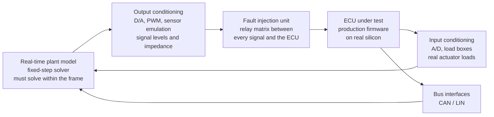

# Hardware-in-the-loop testing

**Status: reference, not built or run.** There is no rig attached to this repository and
nothing here has been executed. It is written to be actionable when you do have one, and
to be honest about the cost before you commit to it.

HIL is the one stage in this repository's testing story that needs capital equipment. It
is also the only one that can tell you what happens when a connector corrodes.

The model-based stages - MIL, SIL and PIL - are in
[04-simulink-test.md](04-simulink-test.md). This document follows the same eight-part
shape so the two read alike: what it proves, what you need, setting it up, authoring,
running, asserting, triage and cadence.

## 1. What HIL is, and what it is not

A HIL rig runs the **complete production firmware on real ECU hardware**, wired through
real electrical connections to a **plant model simulated in real time**. The ECU cannot
tell it is not in the vehicle.

It is routinely drawn as the fourth rung of the MIL → SIL → PIL ladder. It is not the same
kind of thing:

| | MIL / SIL / PIL | HIL |
|---|---|---|
| What is compared | trajectories of the same design in different representations | system behaviour against requirements |
| Under test | one model, or the code generated from it | the whole ECU - firmware, drivers, schedulers, I/O, diagnostics |
| Environment | none; stimulus is a data file | a plant model closing the loop in real time |
| I/O | numbers passed in software | volts and amps through real connectors |
| Finds | code generation and compiler defects | integration, timing, fault-handling and wiring defects |

This restates, rather than contradicts, the warning in
[03-on-target.md](03-on-target.md) §5: the overlay-redirect driver tests keep their RAM
"registers" even when cross-compiled and run on the board, because they are *driver-logic*
tests. Real hardware-in-the-loop tests - does the ADC actually convert? - are a different
category with different fixtures. Do not try to make one file do both.

## 2. What it proves

Everything below is invisible to PIL, because PIL still feeds the target numbers over a
debug link rather than voltages through a harness:

- **The real I/O path.** Sensor → connector → conditioning → ADC → driver → application,
  and back out through the driver → DAC/PWM → load. Scaling errors, reference-voltage
  mistakes and channel mix-ups live here.
- **Real timing under load.** Does the control loop still close when every interrupt is
  firing, the CAN stack is busy and flash is being written?
- **Networks.** CAN/LIN framing, timeouts, bus-off recovery, and the diagnostic session
  and DTC behaviour layered on them.
- **Fault handling** - the reason most rigs get funded. See §5.
- **Start-up, shutdown and degraded modes.** Brown-out, reset during write, limp-home.
- **Safety mechanisms**, which on this part means the hardware ones: see §11.

What it still cannot prove: that the *plant model* is right. A rig validates the ECU
against your model of the world. If that model is wrong, the rig will confidently agree
with it, which is the failure mode to fear most.

## 3. What you need

A rig is a system in its own right:

| Element | Why it matters |
|---|---|
| **Real-time target** running the plant | must be deterministic. A general-purpose OS will not do; frame overruns silently corrupt every result |
| **Plant model** | fixed-step solver only, sized so worst-case solve time fits inside the frame |
| **I/O conditioning** | the ECU must see realistic levels, impedances and rise times, not idealised ones |
| **Load boxes** | real actuator loads, so current draw and back-EMF are real |
| **Sensor emulation** | resistive sensors, current loops, encoders - whatever the ECU expects |
| **Fault injection unit** | a relay matrix able to open, short-to-battery and short-to-ground each line |
| **Bus interfaces** | CAN/LIN, with the ability to inject malformed and missing frames |
| **Programmable power supply** | for brown-out, over-voltage and reset-during-write scenarios |
| **The ECU itself** | production hardware, production firmware build - not a debug build |

Budget the people as well as the hardware. A rig needs an owner; an unmaintained rig
produces confident wrong answers.

## 4. Setting it up

Bring it up in this order. Each step is verifiable on its own, which matters because a rig
that is wrong everywhere at once is close to undiagnosable.

1. **Model the plant first, and validate it offline.** Against vehicle data if you have
   it, against first principles if you do not. Do this before any wiring - §2's warning
   applies.
2. **Prove the real-time target holds its frame** with the plant loaded and no ECU
   attached. Record worst-case execution time, not average.
3. **Wire and verify one channel end to end.** Drive a known value from the plant,
   measure at the ECU connector with a meter, read it back through the ECU's own
   diagnostics. Only then do the next channel.
4. **Add the fault injection matrix** and verify each relay does what its label says,
   with the ECU powered but not yet running the real application.
5. **Close the loop.** Run the ECU against the plant and confirm the system is stable
   before asserting anything about behaviour.
6. **Version the rig configuration alongside the firmware.** Wiring maps, calibration
   constants, plant model version, conditioning settings. A result you cannot reproduce
   because the rig has moved is not evidence.

## 5. Authoring the test

A HIL test is a **scenario**, not an assertion on a function: a sequence of plant
states, bus traffic and faults, with expected ECU responses and timing.

Structure each case as: precondition → stimulus → expected response → timing bound.
Write the timing bound explicitly; "the ECU shall report the fault" is untestable,
"within 200 ms" is.

### The fault-injection catalogue

This is the part no other stage in this repository can reach. Work through it
systematically rather than by inspiration:

| Fault class | Injected as | Typically proves |
|---|---|---|
| **Open circuit** | relay opens the line | out-of-range detection, sensor-missing handling |
| **Short to battery** | line tied to supply | over-range detection, and that nothing is damaged |
| **Short to ground** | line tied to 0 V | under-range detection, current limiting |
| **Line-to-line short** | two signals bridged | plausibility and cross-channel checks |
| **Sensor drift** | plant offsets the value slowly | drift detection thresholds, and that they do not trip spuriously |
| **Stuck-at** | plant freezes the value | staleness detection - a value that never changes is usually not checked |
| **Intermittent** | relay chatters | debounce behaviour, and whether the fault latches when it should |
| **Bus-off / missing frames** | bus interface withholds or corrupts frames | timeout handling, recovery, degraded mode |
| **Brown-out** | supply ramped below threshold | reset behaviour, and non-volatile write integrity |
| **Reset during write** | supply cut mid-EEPROM-write | data integrity - the classic field failure |

For each, assert three things: the ECU **detects** it, **responds** correctly - degraded
mode, output disabled, DTC set - and **recovers** when the fault clears, if recovery is
required. The third is skipped most often and is where latching bugs hide.

### Keep the vectors reusable

The principle from [04-simulink-test.md](04-simulink-test.md) §3 still applies, with a
caveat: plant scenarios usually *can* be shared with MIL, since both drive the same
design. Fault injection cannot - it has no analogue at any other stage. Keep the two
separable so the shareable half stays shareable.

## 6. Running it

- Rig runs are **long and scheduled**, not on demand. Batch cases into a campaign.
- Automate the campaign - manual rig operation does not reproduce. The rig's own tooling
  usually provides the sequencer; drive it from a script under version control.
- Log everything: every ECU output, every plant state, every injected fault, with
  timestamps on one clock. Post-hoc analysis is most of the value, and you cannot go
  back and re-capture.
- Record the firmware build ID and rig configuration version in the results file itself.

## 7. What to assert

Three categories, and they need different treatment:

| Category | Assert | Note |
|---|---|---|
| **Functional** | the ECU produced the right output for the plant state | tolerance comes from the requirement, not from the measurement noise floor |
| **Temporal** | it did so within the required time | the interesting assertion at HIL; the other stages cannot make it |
| **Diagnostic** | the right DTC was set, and cleared when it should be | check the absence of spurious DTCs too, which is usually forgotten |

Measurement noise is real here in a way it is not at MIL/SIL/PIL. Set tolerances from
the requirement and the known accuracy of the rig's instrumentation, and state both. A
tolerance that merely reflects how noisy the rig happens to be today will drift with the
rig.

## 8. When it fails

A HIL failure has a much larger suspect list than a unit test, so triage from the
outside in - **suspect the rig before the firmware**:

1. **The rig.** Wiring, calibration, a relay that did not actuate, a frame overrun on the
   real-time target. Check the rig's own health log first, every time.
2. **The plant model.** Is the scenario physically reasonable? A plant that commands
   something impossible will produce an ECU response that looks wrong and is not.
3. **Test expectation.** Is the timing bound achievable given the ECU's task rates? Bounds
   written from the requirement sometimes ignore the scheduler.
4. **Integration.** Task priorities, scheduling, resource contention - defects that
   exist only when everything runs together, which is exactly what HIL is for.
5. **Unit-level logic.** Last, and if you land here, the real finding is that a unit
   test was missing. Add it at the unit level - see §10 - rather than leaving the rig to
   catch it.

## 9. Cadence

Per integration milestone, release candidate, and after any change to I/O, drivers or
the schedule. Not per commit: rig time is the scarcest resource in the programme, and a
queue for it will reshape how people work.

A useful split is a short **smoke campaign** - an hour, the critical scenarios - per
release candidate, and the **full campaign** including the whole fault catalogue before
release.

## 10. What not to test on a rig

Rig time is expensive and observability is poor. Anything that can be tested at a lower
level should be:

| Do not use HIL for | Use instead |
|---|---|
| Arithmetic, thresholds, state machines | host unit tests - [07](07-unity-best-practices.md), [08](08-test-design-and-strategy.md) |
| Register-level driver behaviour | the register overlay pattern - [05](05-choosing-a-method.md) §2 |
| Model-versus-code equivalence | SIL/PIL - [04](04-simulink-test.md) |
| Endianness and word-size assumptions | the `target` preset - [03](03-on-target.md) |
| Chasing a coverage percentage | anywhere else; structural coverage on a rig is slow and incomplete |

The anti-pattern to watch for is a HIL suite that grows unit tests because the rig is
"where testing happens". It is the same failure the "signals you chose wrong" table in
[05-choosing-a-method.md](05-choosing-a-method.md) §6 describes, at system scale: tests
drift to the most expensive venue that can run them, unless someone actively pushes them
down.

## 11. TMS570-specific mechanisms worth exercising

The safety hardware on this part exists to detect faults you cannot otherwise provoke,
and a rig is the only place its *response* can be observed in a realistic system:

| Mechanism | What to exercise |
|---|---|
| **ESM** (Error Signal Module) | that channels are enabled, and that the error pin drives the external safing path |
| **Lockstep CPU compare** | the CCM-R4 self-test path, and that a compare error reaches a safe state |
| **ECC** on flash and TCRAM | single-bit correction logged, double-bit fault handled |
| **Watchdog (DWD/DWWD)** | that it actually resets when the task loop stalls - windowed mode catches an early kick too |
| **PBIST / LBIST** | start-up self-test timing, and behaviour when it fails |
| **Clock monitoring (DCC)** | loss-of-external-clock detection and fallback |

Most of these can be entered deliberately from software for test purposes. Where the
part provides a self-test or error-forcing register, prefer that over inducing a real
fault - it is repeatable and does not risk the board.

## 12. Traceability

Where HIL evidence sits, if the project carries a functional-safety argument:

| Requirement level | Evidence normally comes from |
|---|---|
| Software unit | host unit tests, with structural coverage |
| Software integration | integration tests; SIL/PIL for generated components |
| System / item | **HIL**, plus vehicle or bench testing |
| Hardware safety mechanism | **HIL** fault injection, plus supplier evidence |

Two cautions, both learned expensively by others:

- **"Test once, credit at multiple levels" has limits.** It is tempting to argue a HIL
  scenario covers a unit requirement because it happens to execute that code. Assessors
  generally expect evidence at the level the requirement lives, with coverage measured
  appropriately for that level. Plan for evidence at each level rather than hoping to
  reuse.
- **Fault injection is evidence for the safety mechanism, not for the software unit.**
  Showing the ECU reacts correctly to a shorted sensor says nothing about whether the
  conversion routine handles its boundary values. Both are needed, and only one of them
  belongs on a rig.

The naming and tracing conventions in
[08-test-design-and-strategy.md](08-test-design-and-strategy.md) §5.4 apply here too:
name cases after requirements, keep identifiers in comments rather than names, and keep
the mapping one-to-many.

## 13. Where this fits with the rest of the repo

| Doc | What it covers |
|---|---|
| [03-on-target.md](03-on-target.md) | the same unit tests cross-compiled and run on the board - driver *logic*, not hardware |
| [04-simulink-test.md](04-simulink-test.md) | MIL, SIL and PIL: is the design right, and did codegen and the compiler preserve it |
| [05-choosing-a-method.md](05-choosing-a-method.md) | picking a pattern and a venue for a given module |
| [08-test-design-and-strategy.md](08-test-design-and-strategy.md) | deriving cases, how much is enough, traceability |
| this document | the system stage: real I/O, real time, fault injection |

Nothing in this repository's build produces a HIL artefact, and nothing in CI exercises
one. This document exists so that when a rig arrives, the approach is already decided.
